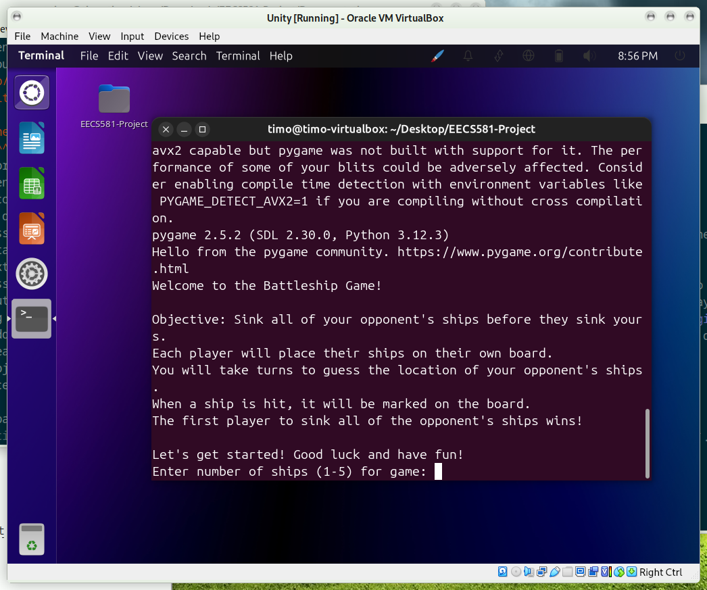

Installation
=====================

Linux
-------------

These instructions assume you are using the latest version of Ubuntu. These instructions may not produce the desired result with other distributions.

Since the program is hosted on Github, it is necessary to install git so that it can be downloaded. To install git run: 

``sudo apt install git``

You may be prompted for your user's password. To download the program itself, run:

``git clone https://github.com/alex634/EECS581-Project.git``

Finally, install the dependencies:

``sudo apt install python3-{tabulate,pygame}``

Running the Program
^^^^^^^^^^^^^^^^^^^^

Enter the directory where the program is located:

``cd EECS581-Project``

Then execute it:

``python3 Main.py``

The program should now run.

